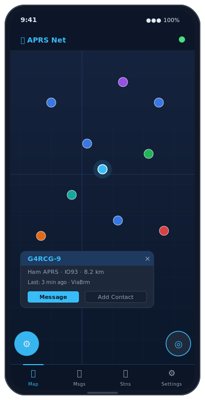

# APRS Net – Android

Native Kotlin/Jetpack Compose Android client for [aprsnet.uk](https://www.aprsnet.uk).

[](https://github.com/2E0LXY/APRS-Android/releases)
[](https://www.gnu.org/licenses/gpl-3.0)


---

## Also available on


| Platform | Repository | Download |
|----------|------------|----------|
| **iOS** | [2E0LXY/APRS-iOS](https://github.com/2E0LXY/APRS-iOS) | [Releases](https://github.com/2E0LXY/APRS-iOS/releases) |
| **Windows / Linux desktop** | [2E0LXY/APRS-Client](https://github.com/2E0LXY/APRS-Client) | [EXE / DEB](https://github.com/2E0LXY/APRS-Client/releases) |
| **Self-host the server** | [2E0LXY/Advanced-APRS-Go-server](https://github.com/2E0LXY/Advanced-APRS-Go-server) | [Install guide](https://github.com/2E0LXY/Advanced-APRS-Go-server#installation-debian-12) |

---

## Features

### 🗺 Map

- Live osmdroid map with real-time APRS station markers, clustering, and position trails
- **TOCALL-based station classification** — firmware-accurate detection:
  - `APLRG*` / `APLRT*` / `APLG*` → LoRa iGate / tracker
  - `APZDMR*` / `APDG*` → MMDVM / DMR gateway
  - `APOG*` → OGN receiver
  - Callsign-string and symbol heuristics retained as fallback
- CWOP weather stations detected by payload symbol `_` (not callsign prefix alone)
- Tap any marker to open a station detail dialog (type, position, distance, bearing, path, comment, last heard)
- **My Location FAB** — centres map to current GPS fix; long-press to force an immediate position beacon
- **Filter FAB** — station type toggles and distance filter (50 / 100 / 250 / 500 km)
- Station types: Ham APRS, CWOP Weather, Ships/AIS, Gliders (OGN), LoRa, MMDVM/DMR, Objects

### 🌊 AIS Ships

- **Server relay** — server subscribes to aisstream.io and relays live vessel positions to all clients
- **Direct connection** (v2.5.7+) — configure an independent `aisstream.io` API key in Settings for a personal direct feed; keeps your key separate from the server key to avoid free-tier conflicts

### 💬 Messaging

- SMS-style conversation threads per callsign, persisted in a local Room database
- **Direct member messaging** (v2.5.10+) — when the recipient is a registered aprsnet.uk member, a delivery route selector (`📡 APRS | ↗ Direct`) appears above the compose bar; Direct bypasses APRS-IS entirely and is delivered instantly via the server WebSocket
- Outgoing message bubbles turn green on ACK receipt; incoming messages are auto-ACKed per APRS spec
- **Server message history sync** — on login and on every WebSocket re-authentication, the app fetches `/api/member/messages` and merges the full server-side history (sent and received, from all devices) into the local Room database
- Deduplication by `serverMsgId` prevents duplicate rows
- **Atmospheric message backgrounds** (v2.5.4+) — 7 selectable Compose Canvas styles in Settings → Appearance → Messages background:
  - Dark Teal, Bright Teal, Green Grid, Green Spotlight, Red Flow, Orange Stripes, Sunset Gradient
- Emoji / smiley rendering at display time only (v2.5.2+) — wire format stays ASCII

### 📡 Smart Beaconing

- **FusedLocationProvider** with `PRIORITY_HIGH_ACCURACY` at 10-second intervals (callbacks delivered on the main looper — background-reliable fix applied in v2.5.12+)
- **Smart beaconing algorithm** — beacon period scales linearly from `slowRate` (20 min when stopped) to `fastRate` (2 min at speed); hard floor of 30 seconds; corner-pegging fires extra beacon on heading changes ≥ 28°
- Foreground `AprsService` keeps beaconing active when the app is in the background — no need to keep the screen on (v2.5.3+)
- Configurable beacon comment and APRS status text
- Station type selector (Fixed / Mobile / Portable) sets appropriate minimum beacon rates per APRS best practice
- Long-press the My Location FAB to force an immediate beacon at any time
- ACCESS_BACKGROUND_LOCATION requested automatically after FINE_LOCATION grant

### ⚙️ Settings & Account

- Callsign, APRS-IS passcode, SSID (0–15)
- **Member account login** — signs in to your aprsnet.uk account; auto-fills APRS-IS passcode from the server; pulls map filter preferences
- **Real-time settings sync** (v2.5.12+) — when preferences are saved from any device (web, desktop, another phone), the server pushes a `member_sync` WebSocket event; the app applies the new preferences immediately without requiring a re-login
- **Account-synced drop filters** — hide Pi-Star/MMDVM, D-STAR gateway, and APDESK traffic; preferences stored server-side and shared with the web map, iOS app, and desktop client
- **Reconnect sync** — on every successful WebSocket re-authentication (rate-limited to once per 5 minutes), the app re-fetches message history and preferences from the server
- Per-type map filters (7 station type toggles, persisted in SharedPreferences and applied immediately)
- Direct aisstream.io API key (optional, separate from server key)
- **Geo-fence alerts** (v2.5.11+) — create server-side rules to fire a notification when any station (or a specific callsign) enters or leaves a named geographic zone; rules sync across all devices via the member API

### 🔔 Notifications

- Push notification on incoming APRS message (via `AprsService` foreground service)
- Notification while app is backgrounded via the foreground service — no missed messages
- Monochrome white notification icon (v2.5.3+) — renders correctly in the Android status bar
- **Quiet hours** — configurable start/end time suppresses notification sound and toasts; badge count still updates silently

### 📱 Post-install Setup

- First-launch setup dialog (v2.5.3+) — prompts for battery-optimisation exemption and home-screen pin shortcut
- ACCESS_BACKGROUND_LOCATION runtime request fired automatically after FINE_LOCATION grant

---

## Quick Start

1. Install the APK — download from [Releases](https://github.com/2E0LXY/APRS-Android/releases)
2. Open the app → **Settings** (gear icon)
3. Enter callsign and APRS-IS passcode under **Credentials**
4. Sign in to your aprsnet.uk member account to enable direct messaging and cross-device sync
5. Set beaconing mode to **Smart** under **Position / Beaconing**
6. Tap **Save** — live stations appear within seconds

Receiving works without any credentials. Sending messages and beaconing require a valid callsign/passcode.

---

## Building

Requires JDK 17 and Android SDK.

```bash
git clone https://github.com/2E0LXY/APRS-Android
cd APRS-Android
./gradlew assembleDebug
```

Signed release AAB (Play Store):
```bash
./gradlew bundleRelease \
  -Pandroid.injected.signing.store.file=/path/to/keystore.jks \
  -Pandroid.injected.signing.store.password=<storepass> \
  -Pandroid.injected.signing.key.alias=aprsnet \
  -Pandroid.injected.signing.key.password=<keypass>
```

GitHub Actions publishes `APRS-Net-Android.aab` and `APRS-Net-Android.apk` on every `v*` tag.

---

## Architecture

```
app/src/main/java/uk/aprsnet/client/
  AprsViewModel.kt          — top-level ViewModel; owns WS, beaconing, station map, sync
  MainActivity.kt           — single Activity; permission handling; service lifecycle
  aprs/
    PacketBuilder.kt        — APRS packet formatting (position, message, ACK, status)
    PacketParser.kt         — position + message parsing, TOCALL classify()
    AprsUtils.kt            — passcode calculator, coord conversion
  data/
    AppDatabase.kt          — Room database (v3), single-instance
    MessageEntity.kt        — message row: remoteCall, text, outgoing, state, serverMsgId
    MessageDao.kt           — CRUD + conversations() Flow + findByServerId()
    MessageRepository.kt    — send, handleIncoming, retrySweep, syncFromServer()
    SettingsStore.kt        — SharedPreferences wrapper for all persisted settings
  location/
    LocationProvider.kt     — FusedLocationProviderClient; callbacks on main looper
    BeaconManager.kt        — SmartBeacon driver; transmits position packets via WS
    SmartBeacon.kt          — shouldBeacon() algorithm (speed-adaptive + corner-peg)
  model/
    MessageState.kt         — SENDING / SENT / ACKED / FAILED enum
  net/
    AprsWebSocket.kt        — OkHttp WS; rawPackets + positionData + memberSyncPrefs
                              + onAuthed SharedFlows; auto-reconnect with backoff
    AprsApi.kt              — REST helper: login, preferences, memberMessages(),
                              memberPreferencesSet(), wx_test
  service/
    AprsService.kt          — foreground service; WS + beacon manager; message notifications
    NotificationHelper.kt   — channel setup, message notification builder
  ui/
    MapScreen.kt            — osmdroid map, FABs, station markers
    StationsScreen.kt       — searchable station list with type filter chips
    ConversationListScreen.kt
    ThreadScreen.kt         — message bubbles, emoji rendering, atmospheric backgrounds
    SettingsScreen.kt       — all settings cards including beaconing, member, geo-fence
    StatusScreen.kt         — WS state, last beacon, server stats
    GeoFenceScreen.kt       — rule list + create/delete
    InfoScreen.kt           — feature help cards
```

---

## Changelog

| Version | Changes |
|---------|---------|
| v2.5.12 | Location Looper fix — GPS callbacks now always delivered (background-reliable); real-time `member_sync` WS event handling; reconnect message + prefs sync (5-min rate-limit) |
| v2.5.11 | Geo-fence alert rules — `GeoFenceScreen`, server CRUD, WS alert → local notification |
| v2.5.10 | Direct member-to-member messaging with delivery route selector (APRS \| Direct) |
| v2.5.9 | Atmospheric message backgrounds applied to Stations and Contacts screens |
| v2.5.8 | Fix missing `AprsApi` import after refactor |
| v2.5.7 | Direct aisstream.io AIS — `AisWebSocket`, `aisApiKey` setting, AIS card in Settings |
| v2.5.6 | TOCALL-based LoRa/MMDVM/OGN classification in `PacketParser.classify()` |
| v2.5.5 | Fix AlertDialog and BoxScope imports in MainActivity |
| v2.5.4 | Atmospheric message section backgrounds — 7 styles, Compose Canvas |
| v2.5.3 | Background beaconing reliability; monochrome notification icon; post-install setup dialog; background location permission |
| v2.5.2 | Emoji rendering in message bodies (display-time only) |
| v2.5.1 | Robust passcode auto-fill on member login |
| v2.5.0 | Sync map filter preferences with server member account on login |
| v2.4.x | Map overlay z-order; navigation restructure; IME keyboard fix; TOCALL classification; SSID bugfix; filter FAB; AIS integration |
| v2.3.x | Kotlin/Compose rewrite — dark glass theme, conversation list, thread view |

---

## Licence

GNU General Public Licence v3 — © 2026 Daren Loxley 2E0LXY
